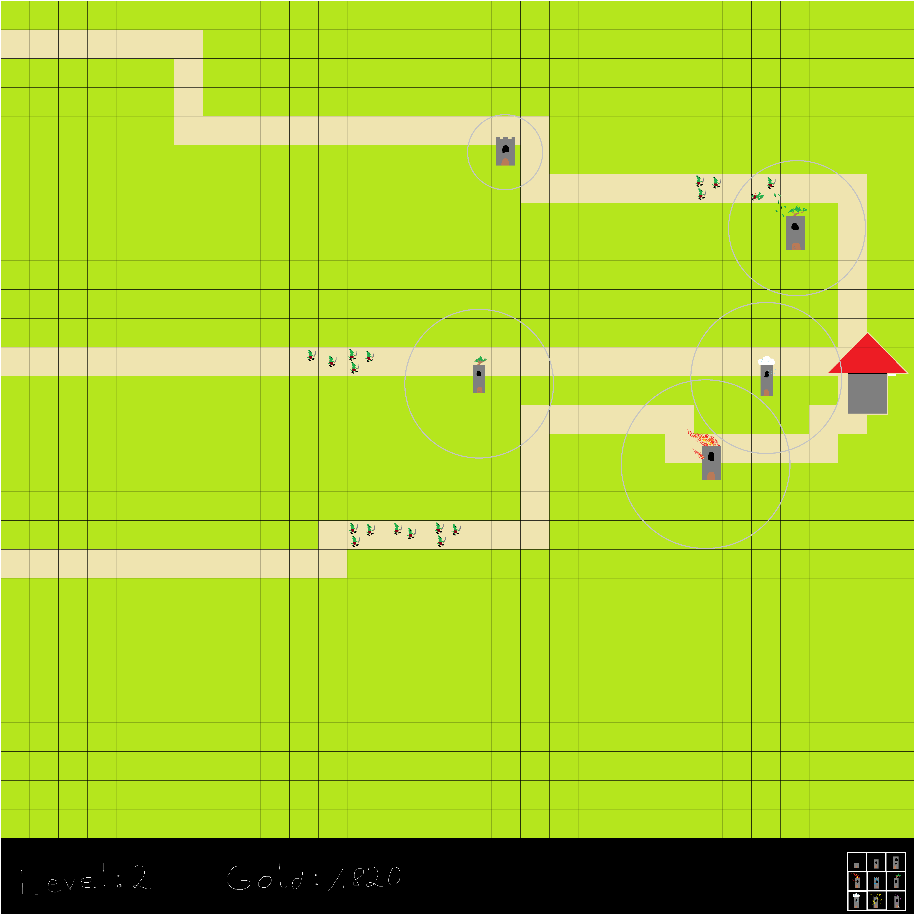

# Game

Spiel Programmierung mit SDL2

**15.04.2021**

Wir haben heute interessante Ideen für ein Spiel gesammelt.
Wir haben auch von Freunden ein zwei Ideen bekommen. 
Am Anfang hatten wir diese Ideen: Banished, Bloons Towerdefense 5, Harvest Moon PS1, Mario, Binding of Isaac, Pushi. 
Die engere Auswahl ist bei Pushi und Bloons Towerdefense 5 gelandet, da die anderen Spiele wahrscheinlich den Rahmen sprengen würden oder simple sind.
Wir haben uns jetzt auf Bloons Towerdefense entschieden, da man dort viel mehr unterschiedliche Sachen machen kann. Wie z.B. andere Wege, Gegnerarten, Hintergründe, Level, u.v.m. Wir können viele eigene Ideen dort einbinden.
Wir benutzen die IDE VisualStudio, da wir dort gute Erfahrungen gemacht haben und viele im Netz die IDE in Kompination mit SDL2 benutzen. Wir haben bereits ein Projekt erstellt und es soweit vorbereitet, dass wir mit dem Spiel anfangen können.

Das Konzept:

- mehrere Level mit unterschiedlichen Wegen, vielleicht auch andere Gegner und Helden
- aktuell sind die Helden unten rechts, müssen sie wahrscheinlich noch größer machen
- Helden haben alle unterschiedliche Fähigkeiten, manche haben höhere Reichweite, höhere Schadenserzeugung, die Bälle haben unterschiedliche Farben, man kann noch vieles verändern
- als Gegner wissen wir noch nichts genaues, vielleicht Goblin, Ritter oder andere Figuren
- als Held haben wir für den Anfang Türme
- es wird eine Währung geben, aber aktuell nicht weiter geplant

Idee der Umsetzung:
- Matrix als Spielfeld, in der Matrix steht an welcher Stelle die Gegner, Wege, Türme sind

**16.04.2021**

