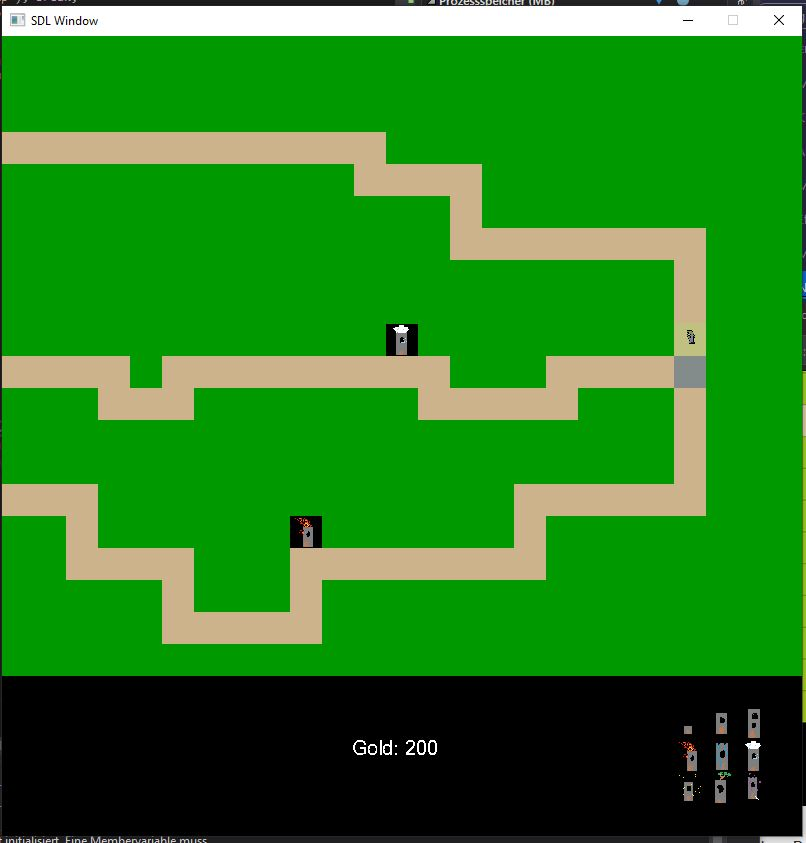
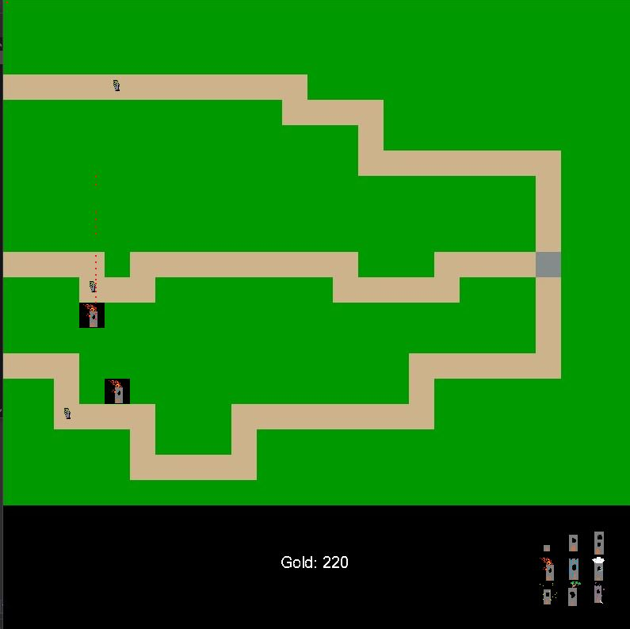

# Game

Spiel Programmierung mit SDL2

**15.04.2021**

Wir haben heute interessante Ideen für ein Spiel gesammelt.
Wir haben auch von Freunden ein zwei Ideen bekommen. 
Am Anfang hatten wir diese Ideen: Banished, Bloons Towerdefense 5, Harvest Moon PS1, Mario, Binding of Isaac, Pushi. 
Die engere Auswahl ist bei Pushi und Bloons Towerdefense 5 gelandet, da die anderen Spiele wahrscheinlich den Rahmen sprengen würden oder simple sind.
Wir haben uns jetzt auf Bloons Towerdefense entschieden, da man dort viel mehr unterschiedliche Sachen machen kann. Wie z.B. andere Wege, Gegnerarten, Hintergründe, Level, u.v.m. Wir können viele eigene Ideen dort einbinden.
Wir benutzen die IDE VisualStudio, da wir dort gute Erfahrungen gemacht haben und viele im Netz die IDE in Kompination mit SDL2 benutzen. Wir haben bereits ein Projekt erstellt und es soweit vorbereitet, dass wir mit dem Spiel anfangen können.

Das Konzept:

- mehrere Level mit unterschiedlichen Wegen, vielleicht auch andere Gegner und Helden
- aktuell sind die Helden unten rechts, müssen sie wahrscheinlich noch größer machen
- Helden haben alle unterschiedliche Fähigkeiten, manche haben höhere Reichweite, höhere Schadenserzeugung, die Bälle haben unterschiedliche Farben, man kann noch vieles verändern
- als Gegner wissen wir noch nichts genaues, vielleicht Goblin, Ritter oder andere Figuren
- als Held haben wir für den Anfang Türme
- es wird eine Währung geben, aber aktuell nicht weiter geplant

Idee der Umsetzung:
- Matrix als Spielfeld, in der Matrix steht an welcher Stelle die Gegner, Wege, Türme sind

**16.04.2021**

**27.04.2021**
Wir hatten Probleme mit Visual Studio und Github. Jedesmal wenn wir das Projekt mit Visual Studio geöffnet haben wollte er Dateien mit Gitbash hochladen, die wir aber nicht hochladen wollten. Wenn der andere von uns beiden die Sachen versuchte zu öffnen oder zu nutzen mussten wir jedesmal Mergen und es funktionierte nicht. 
Ein Studienkollege hat uns dabei geholfen und wir haben ein komplett neues projekt bei Github erstellt. Und wir haben die coole GitHub Desktop software kennengelernt. Es ist richtig cool und es funktioniert viel besser als GitBash.

**30.04.2021**
Wir haben die Oberfläche erstellt. Wir können jetzt Wege malen und Türme an eine bestimmte Stelle setzen. Für die Türme haben wir kleine Bilder gemalt und zum Einbinden haben wir die Funktion "mage = SDL_LoadBMP("small.bmp");" genutzt. Wir haben nur keine Ahnung ob es einen Unterschied macht, ob man eine bmp Datei einbindet oder eine jpg. Wir haben es als bmp gelassen, weil es funktioniert, aber vielleicht ändern wir es noch. Keine Ahnung. Es ist auf jedenfall ein gutes Gefühl, dass es jetzt erstmal läuft.

**06.05.2021**
Wir haben in der letzten Woche die Türme erfolgreich platziert. Wir wollen uns nun auf die Gegner fokussieren.
Wir schauen uns dazu mehrere Tutorials an um eine Idee zu bekommen wie wie die Gegner am besten über das Spielfeld leiten.
Wie haben es mit bmp geschafft, den Gegner über das Feld zu leiten. Jedoch haben wir das Problem, dass die felder über die der Gegner läuft die Hintergrundfarbe des Gegner-Images annimmt. 
Wir nehmen an, dass das Problem gelöst werden kann indem wir ein Bild nehmen welches keinen Hintergrund hat, dazu müssen wir jedoch von bmp auf png umsteigen.
Dafür binden wir die Bibliothek SDL_image ein mit der soll es möglich sein png's einzufügen.
Uns ist es noch nicht gelungen ein png einzufügen.

**07.05.2021**
Wir haben weiter vertsucht den Gegner als png einzubinden aber weiterhing kein Erfolg.
Uns ist beim Testen ein schwerwiegender Fehler aufgefallen, wenn wir wärend der Gegner läuft einen Turm setzen wollen, aktuallisiert die Oberfläche nicht wie gewünscht.
Nach ein Paar modifikationen im Code haben wir das Problem aber gelöst und widmen uns wieder dem Gegner.
Wir gucken uns weitere Tutorials an um einen neue Herrangehensweise zu finden. Wir haben eine gefunden die nach unserem Verständniss funktionieren sollte.
Wir haben angefangen diese Herrangehensweise zu implementieren.

**14.05.2021**
Heute haben wir das Problem mit dem Flackernden Bild gelöst. Wir waren so dumm und haben überall alles neu gerendert. Das haben wir entfernt und es funktioniert jetzt schön gleichmäßig. Unser andreres Problem mit dem Speicherplatz konnten wir leider nicht lösen, wir haben alle möglichen Texture, Surfaces und die Bibliotheken gefreet, aber unser Programm stürzt immer noch nach 30 sekunden ab. Wir haben keinen Ahnung mehr, woran es liegen könnte. 

Beim letzten Mal hatten wir den Golums die Bewegung gegeben, und heute haben wir es mit mehreren Golums auf verschiedenen Wege ausprobiert. Leider ist uns dabeiaufgefallen, dass die Golums nicht nach oben laufen können. Nach rechts und nach unten funktioniert es, nur nicht nach oben. Wenn er nach oben laufen soll, bleibt er an einer Stelle stehen. Wir haben an irgendeiner Stelle ein Denkfehler, aber bis jetzt noch nicht gelöst. Aber die Golums können mit Unterschiedlichen Geschwindigkeiten laufen und das ist cool. Aber das die Golums nicht nach oben laufen können, müssen wir unbedingt noch lösen.

Die Türme können seit heute im Umkreis eines bestimmten Radius  Golums erkennnen und auf sie schießen. Wir prüfen bei jedem Schleifendurchlauf ob ein Golum im Umkreis ist, wenn dies geschieht, nehmen wir diese Position und schießen Kugeln auf den Golum. Der Turm bringt dadurch den Golum um.  Es fühlt sich langsam an, wie ein kleines echtes Spiel.

**20.05.2021**
Heute haben wir mit viel Hilfe unser Problem des Datenspeichers gelöst bekommen. 
Dadurch konnten wir auch andere Speicherprobleme wir z.B. mit den Attacken schnell lösen. Bei den Attacken hatten wir das gleiche Problem, dass unser Array zu voll war. 
Wir konnten den Türmen einen Kreis hinzufügen, dass heißt der Spieler kann jetzt nachvollziehen, in welchem Bereich der Turm auf die Gegner schießt. Dann haben wir auch einen Teil des Endes eingebaut und zwar das Verlieren des Spieles. Das Gewinnen dauert noch ein bisschen, aktuell müssen wir uns noch entscheiden, wann der Spieler gewonnen hat, wie schnell die Gegner sein sollen, welchen Radius die Türme haben, welchen Schaden sie machen können und vieles mehr. Aktuell haben wir für alles grobe Werte, die wir zum Ende hin noch verfeinern müssen. 

Genauso wie wir die Gegner per Random aufs Spielfeld setzen, zu random Zeiten. Leider sind wir uns unsicher, ob wir es per Random lassen oder einen vordefinierten Programmablauf machen wollen. Da sind wir uns aktuell uneinig. Leider ist uns durch das Random aufgefallen, dass die Gegner mit unterschiedlichen Geschwindigkeiten wieder die falschen Wege nehmen. Das ist ziemlich doof, vorallem nachdem wir dachten wir hätten es fertig. Aber leider Pech gehabt.

